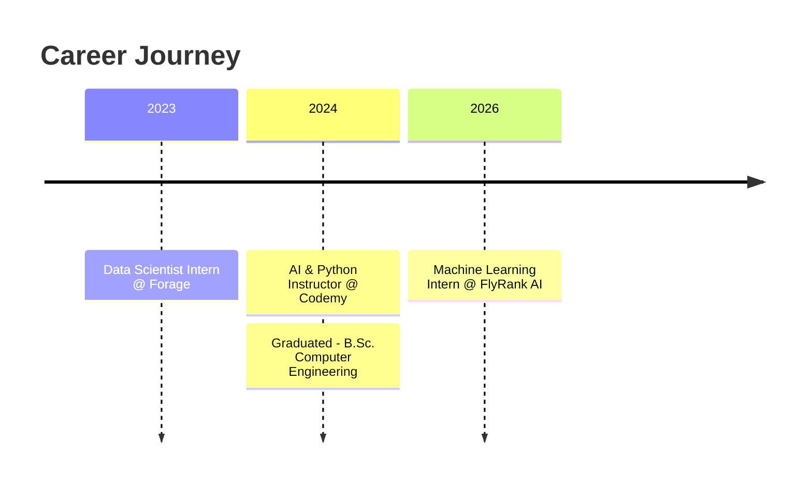

<div align="center">

<!-- Animated wave banner -->


<!-- Typing animation -->
<a href="https://linkedin.com/in/abdul-rahman-magdy-albasousy-80267424b">
  
</a>

<br/>

<!-- Social badges -->
<a href="https://linkedin.com/in/abdul-rahman-magdy-albasousy-80267424b"></a>
<a href="mailto:abdulrahmanalbasousy@gmail.com"></a>
<a href="https://abdulrahmanalbasousy.getportify.com"></a>
<a href="tel:+201212104758"></a>

<br/><br/>

<!-- Profile views + status badges -->


</div>

---

## 🧠 About Me

```yaml
name: Abdul Rahman Magdy Albasousy
role: AI Engineer / Data Scientist / GenAI Specialist
location: Egypt
education: B.Sc. Computer Engineering, BHI (2019 - 2024)
current_focus:
  - LLMs, RAG & Agentic AI Systems (LangChain)
  - MLOps: Docker, MLflow, CI/CD
  - Teaching AI & Python to the next generation of engineers
certifications:
  - AWS Certified AI Practitioner
fun_fact: "I build systems that read logs, plates, and player stats -- so I don't have to."
```


- 🔭 Currently building **DarkAtlas** — an AI-powered infrastructure asset management platform
- 🌱 Deepening expertise in **RAG pipelines & agentic AI workflows**
- 👨‍🏫 Teaching Python & AI at **Codemy**
- 💬 Ask me about **LangChain, Computer Vision, or MLOps**
- ⚡ Fun fact: I taught YOLO to read license plates before I taught it to my students

<br clear="both"/>

---

## 🛠️ Tech Arsenal

<div align="center">

### Languages


### AI / ML / GenAI


### Backend & Infra


### Data


</div>

---

## 📊 GitHub Stats

<div align="center">


<br/>


</div>

---

## 🚀 Featured Projects

<table>
<tr>
<td width="50%" valign="top">

### 🧩 DarkAtlas
**AI-Powered Infrastructure Asset Management**

`FastAPI` `PostgreSQL` `LangChain` `Ollama` `Docker`

- Smart upsert ingestion for domains, IPs, certs & services
- LangChain + local Ollama layer: NL querying, risk assessment, enrichment, report generation
- Fully containerized, **zero external API dependencies**
- Auto-generated Swagger docs

</td>
<td width="50%" valign="top">

### 🚗 License Plate Detection & Verification
**Real-Time Computer Vision System** — *Graduation Project*

`YOLO` `PaddleOCR` `OpenCV` `Flask`

- Custom-trained YOLO model for plate detection
- Live video feed processing via OpenCV
- PaddleOCR for character recognition
- Automated gate access control via Flask API

</td>
</tr>
<tr>
<td width="50%" valign="top">

### ⚽ Season Rating Prediction Model
**Sports Analytics ML Pipeline**

`Scikit-learn` `Flask` `PostgreSQL` `Hugging Face`

- EDA & visualization to guide feature selection
- Trained model to predict player season ratings
- Deployed via Flask + PostgreSQL
- End-to-end automated data pipeline

</td>
<td width="50%" valign="top">

### ✈️ British Airways Customer Insights
**Web Scraping & ML** — *Forage Virtual Internship*

`Python` `Web Scraping` `Scikit-learn`

- Scraped & analyzed customer review data
- Cleaned and preprocessed raw datasets
- Built a model to predict customer buying behavior

</td>
</tr>
</table>

---

## 💼 Experience Timeline



---

## 📜 Certifications

<div align="center">


</div>

---

## 📈 Contribution Snake

<div align="center">

</div>

---

<div align="center">

### 📫 Let's Build Something Intelligent Together

<a href="mailto:abdulrahmanalbasousy@gmail.com"></a>


</div>
